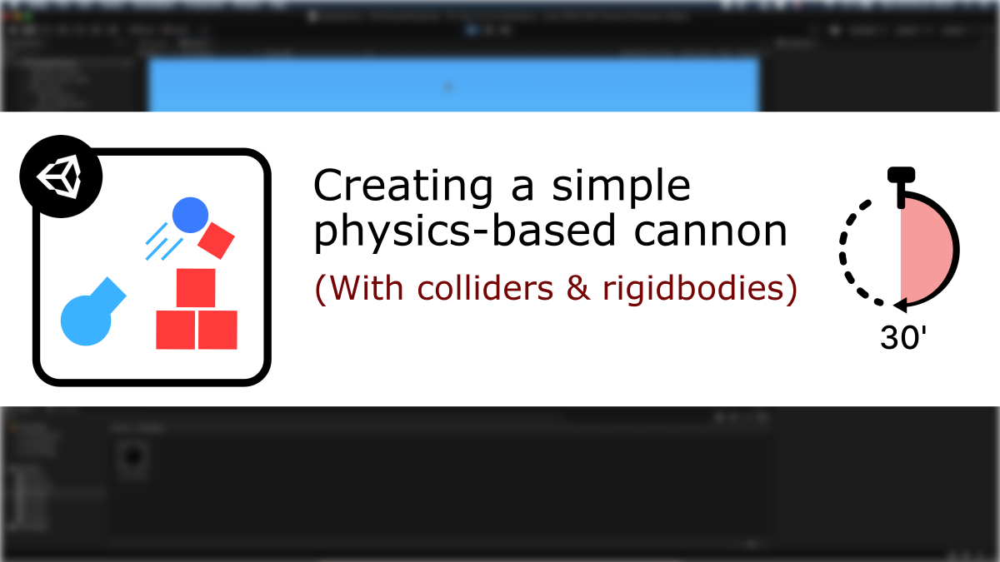
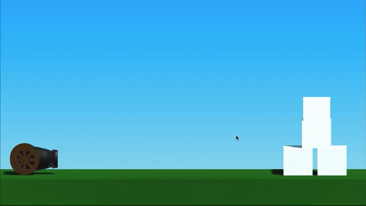

# [Unity/C#] A simple physics-based cannon (with colliders+rigidbodies)

**Mina Pêcheux - October 2021**

How can we make a simple physics-based cannon that throws cannon balls at obstacles, and even shows the expected trajectory of the projectiles? Let's discover more in this video/text tutorial: "How to make a simple physics-based cannon in less than 30 minutes" :)

You can read it in text format [on Medium](https://mina-pecheux.medium.com/how-to-make-a-simple-physics-based-cannon-in-unity-c-219a6a21d3d6), or watch it [on Youtube](https://www.youtube.com/watch?v=xHYmUGyCwQU).

In this less than 30 minutes-tutorial, I'm discussing how to setup a basic scene with some imported FBX model, how to have an object follow the mouse and how to use Newtonian physics to compute the expected trajectory of an object in 3D. We'll also play around with colliders, rigidbodies and line renderers!

This Github repo contains the script that is coded in the tutorial, as well as all the resources (imported models, materials, shaders...) that are used throughout this episode :)

